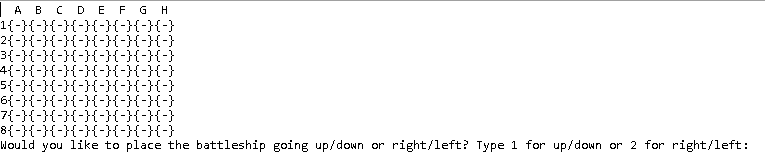

# Battleship

## Synopsis
This is a 2 player text based battleship game where 2 users go against each other in the classic game of battleship

## Motivation
I was motivated to start this project because in an earlier module in my course, I had to design a simple version of text based Tic-Tac-Toe.
It was fun to create Tic-Tac-Toe and I decided to take it to the next level with battleship and test my skills. 

## How to Play
To play, you only need one computer and one keyboard. Once the program is running, it will prompt you to enter letters and numbers 
as input to determine where you want to place your ships, and where you want to attack. At the end of the game, you will be given the option 
to play again or view the game boards from the current game. 


## Code Example
This piece of code used the letter of the column given by the user to determine what space in the game board array was needed.
```
public static int getColTile(char userColTile, char[] columnLetters) {
	    int colTile = 0;
	    switch(userColTile) {
            case 'A':
            case 'a':
                colTile = 2;
                break;
            case 'B':
            case 'b':
                colTile = 5;
                break;
            case 'C':
            case 'c':
                colTile = 8;
                break;
            case 'D':
            case 'd':
                colTile = 11;
                break;
            case 'E':
            case 'e':
                colTile = 14;
                break;
            case 'F':
            case 'f':
                colTile = 17;
                break;
            case 'G':
            case 'g':
                colTile = 20;
                break;
            case 'H':
            case 'h':
                colTile = 23;
                break;
        }
        return colTile;
    }
```

## Tests
Tests are run with Junit4. To test what number a column letter would return, just replace 'letter' with the letter and replace "result" 
with your expected return.
```
assertEquals(Battleship.getColTile('letter', "ABCDEFGH".toCharArray()), result);
```

## Files explained
Battleship.java- The code for the game
BattleshipTest.java- The Junit4 Test
Battleship.zip- the full project in a zipped folder(contains code, Junit test, and Javadocs files)
